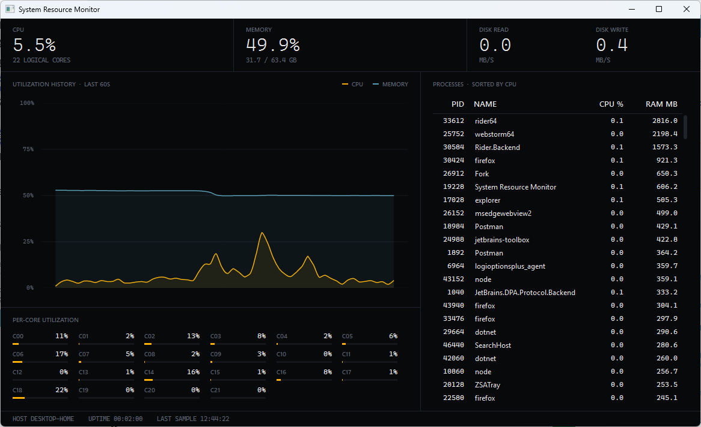
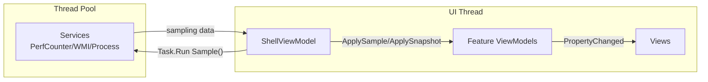

# System Resource Monitor

A Windows desktop dashboard for live CPU, memory, disk, and process metrics, built in WPF on .NET 9 using MVVM (Model-View-ViewModel) and Dependency Injection.



## Features

- Overall and per-core CPU utilization for every logical processor
- Used / available / total physical memory with derived percentage
- Disk read and write throughput in MB/s
- 60-second rolling history chart for CPU and memory
- Sortable process list with per-PID CPU% and memory usage
- 1 Hz sampling that never blocks the UI thread

## Architecture

The app is a single window composed of feature views that each bind to their own ViewModel.<br />
A `ShellViewModel` aggregates the feature ViewModels (Process List, CPU %, Memory %, etc), owns the sampling loop, and is the only `DataContext` `MainWindow` ever sees.

Each one-second tick crosses a thread boundary: sampling runs on the thread pool, results are applied to the bound ViewModels on the UI thread, and XAML data binding takes care of the redraw.



- **MVVM** is provided by `CommunityToolkit.Mvvm`: ViewModels are `partial` classes whose observable properties are generated from `[ObservableProperty]` fields. No `INotifyPropertyChanged` boilerplate, no code-behind logic in any view.
- **Dependency injection** is wired up in [`App.OnStartup`](App.xaml.cs): services and ViewModels are registered as singletons against `Microsoft.Extensions.DependencyInjection`, and `MainWindow.DataContext` is resolved from the container.
- **Async sampling** is driven by a single `PeriodicTimer` in [`ShellViewModel`](ViewModels/ShellViewModel.cs). Each tick pushes the counter reads onto the thread pool via `Task.Run`, then applies the resulting samples to the bound ViewModels on the UI thread.

## Project structure

```
System Resource Monitor/
├── Models/                             Plain data records returned by services
│   ├── CpuSample.cs
│   ├── DiskSample.cs
│   ├── MemorySample.cs
│   └── ProcessInfo.cs
├── Services/                           System-data retrieval, each behind an interface:
│   ├── CpuService.cs                       PerformanceCounter: % Processor Time
│   ├── MemoryService.cs                    PerformanceCounter + WMI
│   ├── DiskService.cs                      PerformanceCounter: PhysicalDisk Bytes/sec
│   └── ProcessService.cs                   Process.GetProcesses + TotalProcessorTime deltas
├── ViewModels/                         ShellViewModel plus one ViewModel per feature
│   ├── ShellViewModel.cs
│   ├── CpuViewModel.cs
│   ├── MemoryViewModel.cs
│   ├── DiskViewModel.cs
│   ├── HistoryChartViewModel.cs
│   └── ProcessListViewModel.cs
├── Views/                              UserControls; each .xaml.cs only calls InitializeComponent()
│   ├── CpuView.xaml
│   ├── MemoryView.xaml
│   ├── DiskView.xaml
│   ├── HistoryChartView.xaml
│   └── ProcessListView.xaml
├── Themes/                             Palette, typography, and ControlTemplates for the dark theme
│   └── DarkTheme.xaml
├── App.xaml(.cs)                       DI bootstrap; manual MainWindow creation in OnStartup
└── MainWindow.xaml(.cs)                Window shell hosting the header strip, body, and footer
```


## Requirements

- Windows 10 1903 or newer (for `Cascadia Mono`; `Consolas` is the fallback font so older versions still work)
- [.NET 9 SDK](https://dotnet.microsoft.com/download)

## Build and run

```pwsh
dotnet build
dotnet run --project "System Resource Monitor.csproj"
```

Or open `System Resource Monitor.csproj` in Visual Studio or JetBrains Rider and run.

## Dependencies

| Package                                                                                                               | Purpose                                                                                     |
|-----------------------------------------------------------------------------------------------------------------------|---------------------------------------------------------------------------------------------|
| [`CommunityToolkit.Mvvm`](https://www.nuget.org/packages/CommunityToolkit.Mvvm)                                       | `ObservableObject`, `[ObservableProperty]` / `[NotifyPropertyChangedFor]` source generators |
| [`Microsoft.Extensions.DependencyInjection`](https://www.nuget.org/packages/Microsoft.Extensions.DependencyInjection) | Service / ViewModel container bootstrapped in `App.OnStartup`                               |
| [`LiveChartsCore.SkiaSharpView.WPF`](https://www.nuget.org/packages/LiveChartsCore.SkiaSharpView.WPF)                 | History chart, rendered with SkiaSharp                                                      |
| [`System.Diagnostics.PerformanceCounter`](https://www.nuget.org/packages/System.Diagnostics.PerformanceCounter)       | Live CPU, memory, and disk counters                                                         |
| [`System.Management`](https://www.nuget.org/packages/System.Management)                                               | WMI query for total physical memory                                                         |
